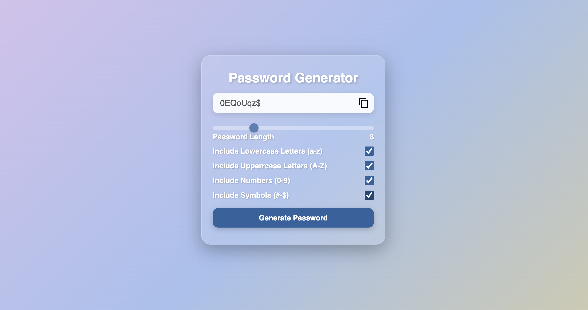

# Password Generator

A simple and customizable Password Generator built using HTML, CSS, and JavaScript. This tool allows users to generate secure passwords based on their preferences.

## Preview




## Features

- **Customizable Options**:
  - Include lowercase letters.
  - Include uppercase letters.
  - Include numbers.
  - Include symbols.
- **Password Length**: Adjustable using a slider.
- **Copy to Clipboard**: Easily copy the generated password with a single click.
- **Dynamic Updates**: The password length updates in real-time as you adjust the slider.

## Project Structure

```
Password Generator/
├── index.html       # Main HTML file
├── style.css        # Styling for the app
├── script.js        # JavaScript functionality
```

## How to Use

1. Open the `index.html` file in any modern web browser.
2. Adjust the password length using the slider.
3. Select the character types you want to include (lowercase, uppercase, numbers, symbols).
4. Click the "Generate Password" button to create a password.
5. Use the copy icon to copy the generated password to your clipboard.


## Technologies Used

- **HTML**: For the structure of the app.
- **CSS**: For styling the app.
- **JavaScript**: For adding interactivity and password generation logic.

## How to Run Locally

1. Clone this repository or download the project files.
2. Open the `index.html` file in your browser.

## Future Enhancements

- Add a strength indicator to evaluate the security of the generated password.
- Allow users to exclude similar-looking characters (e.g., `O` and `0`, `l` and `1`).
- Add a dark mode toggle for better user experience.

## License

This project is open-source and available under the [MIT License](LICENSE).